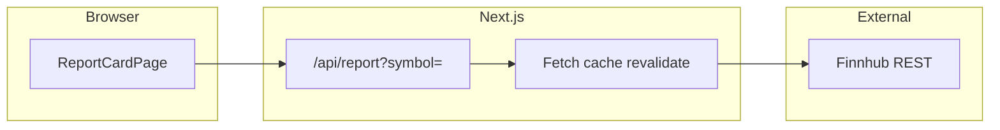

# Stock report card website (global tickers, free-tier data)

## Goals

- User enters a **company/stock identifier** (with exchange awareness for global listings).
- The site returns a **report card**: grouped metrics (valuation, profitability, balance sheet, analysts, sentiment), each with a **score or letter grade** and short context.
- Constraints from you: **global stocks**, **mostly free API tiers** (keys OK, accept rate limits).

## Recommended stack

- **[Next.js](https://nextjs.org/) (App Router) + TypeScript** — server components and Route Handlers to **keep API keys off the client**, built-in caching (`revalidate`) to respect rate limits.
- **Tailwind CSS** — fast, consistent styling for card layouts and grade colors.
- **No database in v1** — compute on read, cache responses per symbol for a few minutes to hours.

## Data strategy (free-tier first)

| Area                              | Source                                                                                                                                                                                                                                                                                                                                                                                                                                           | Notes                                                                                                                                                                                |
| --------------------------------- | ------------------------------------------------------------------------------------------------------------------------------------------------------------------------------------------------------------------------------------------------------------------------------------------------------------------------------------------------------------------------------------------------------------------------------------------------ | ------------------------------------------------------------------------------------------------------------------------------------------------------------------------------------ |
| Quote, profile, global symbol     | [Finnhub](https://finnhub.io/docs/api/introduction)                                                                                                                                                                                                                                                                                                                                                                                              | Strong global symbol support; free tier is **60 calls/min** — aggregate endpoints in **one server route** per report to stay under budget.                                           |
| Valuation ratios (P/E, P/B, etc.) | Finnhub company metrics / basic financials (as available for the symbol)                                                                                                                                                                                                                                                                                                                                                                         | Some fields may be `null` for thinly covered tickers — UI must degrade gracefully.                                                                                                   |
| “Top firms” / analyst view        | Finnhub **price target consensus** + **recommendation trends** (if your key can access them)                                                                                                                                                                                                                                                                                                                                                     | This is the realistic “valuation from analysts” story on a free tier: **mean/median/high/low target** vs spot, and **buy/hold/sell trend**, not necessarily 20 individual bank PDFs. |
| Fear & Greed (equities)           | **No reliable official free API** for CNN’s classic index. Practical v1 options: (a) **optional** lightweight fetch of a public CNN data feed *if* you accept breakage/TOS risk, or (b) **prefer** a **market stress proxy** from data you already have: **VIX** (index quote via same provider if allowed), **52-week position**, **Finnhub news sentiment** if exposed on your plan. Label the widget honestly (“market stress” vs “CNN F&G”). |                                                                                                                                                                                      |

**Ticker UX for global:** Finnhub uses symbols like `7203.T`, `005930.KS`, etc. v1 should include **symbol search** ([Finnhub symbol search API](https://finnhub.io/docs/api/symbol-search)) so users don’t guess suffixes; show company name + exchange before generating the report.

**Secrets:** `FINNHUB_API_KEY` in `.env.local`; all Finnhub calls only from Route Handlers / server actions.

## Architecture

- `**GET /api/report**` (or server component loader): input `symbol`, parallel-fetch Finnhub slices needed for the card, merge, return a single DTO.
- **Normalization layer** (`lib/metrics.ts`): map raw JSON → unknown-safe parsing, sector-aware defaults later optional.
- **Scoring layer** (`lib/grades.ts`): pure functions that map each metric to `0–100` or `A–F` using **documented thresholds** (e.g. P/E vs historical median is misleading without sector — v1 can use **simple bands** + disclaimers, or compare to **same-sector peers** in v2 via extra calls).

## Report card sections (MVP)

1. **Header** — Name, exchange, last price, currency, as-of time, data delay notice.
2. **Valuation** — P/E, P/B, P/S (where present), maybe EV/EBITDA; grade + one-line interpretation.
3. **Profitability & growth** — margins, revenue/EPS growth if available.
4. **Balance sheet / risk** — debt/equity, current ratio, interest coverage if available.
5. **Analysts** — consensus price target vs price, high/low range, recommendation breakdown.
6. **Sentiment / stress** — VIX + optional news sentiment or clearly labeled alternative; avoid pretending it is CNN if it is not.

Each section: **grade badge**, **sparkline optional (v2)**, **source footnote** (“Finnhub”).

## UI / UX

- Landing: **search** + recent symbols (localStorage).
- Report: **responsive grid** of cards; accessible contrast for grade colors; loading skeleton; error states for not found / rate limit.
- **Disclaimer strip** — not investment advice; data delays; free-tier limitations.

## Rate limits and reliability

- Batch Finnhub calls with `Promise.all`; handle partial failures (show section-level errors).
- Use `next: { revalidate: 3600 }` (or similar) for expensive aggregations so repeat views don’t burn quota.
- Optional: simple in-memory LRU **per server instance** for dev; production can rely on Next fetch cache + CDN.

## Deliverables (repo layout sketch)

After you approve execution, scaffold:

- `[package.json](/Users/dpark/Documents/P1/package.json)`, Next + TS + Tailwind
- `[app/page.tsx](/Users/dpark/Documents/P1/app/page.tsx)` — search + report view
- `[app/api/report/route.ts](/Users/dpark/Documents/P1/app/api/report/route.ts)` — aggregator
- `[lib/finnhub.ts](/Users/dpark/Documents/P1/lib/finnhub.ts)` — typed fetch helpers
- `[lib/grades.ts](/Users/dpark/Documents/P1/lib/grades.ts)` — scoring
- `[.env.example](/Users/dpark/Documents/P1/.env.example)` — `FINNHUB_API_KEY=`

## Future upgrades (out of MVP)

- **Sector-relative valuation** (extra Quote/metrics calls or a second provider).
- **Per-broker price targets** if you add a paid tier (FactSet, Refinitiv, etc.).
- **User accounts + saved watches** once you add a DB.

## Risk note

Relying on a single free provider means **coverage gaps** for some international tickers; the plan above handles that with explicit empty states rather than fake numbers.