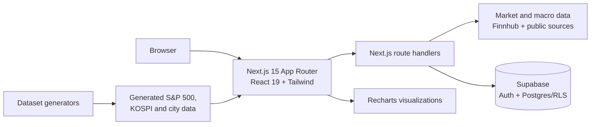

# finance.hub

Personal finance command center built with Next.js. It brings market data, macro indicators, comparisons, and planning calculators into one responsive web app. The product is informational and educational; it is not financial advice.

## What it includes

- Stock report cards, price charts, S&P 500/KOSPI heat maps, and watchlists
- Cost-of-living and lifestyle affordability comparisons across US cities
- Foreign-exchange rates, policy-rate history, savings, and credit-card comparisons
- Capital-flow charts and high-volume prediction-market probabilities
- Compound-interest, mortgage, FIRE, and debt-payoff calculators
- Optional Supabase sign-in for saved preferences, watchlists, and scenarios

## Architecture



The UI and API live in one Next.js application. Pages are in `src/app`, reusable UI in `src/components`, server/data helpers in `src/lib`, and the Supabase schema in `supabase/migrations`. Authenticated `/api/me/*` handlers keep each user's saved data isolated through Supabase Row Level Security.

## Hardware and software

No specialized hardware is required.

| Use | Requirement |
| --- | --- |
| Development | Any current macOS, Windows, or Linux computer; 8 GB RAM recommended |
| Runtime | Node.js 20+ and npm |
| Client | A modern desktop or mobile browser |
| External services | Finnhub account for stock reports; Supabase project for sign-in and saved data |

## Local setup

```bash
git clone https://github.com/dpark1719/Finance.hub.git
cd Finance.hub
npm ci
cp .env.example .env.local
npm run dev
```

Open [http://localhost:3001](http://localhost:3001). Add the following values to `.env.local` as needed:

```dotenv
FINNHUB_API_KEY=
NEXT_PUBLIC_SUPABASE_URL=
NEXT_PUBLIC_SUPABASE_ANON_KEY=
```

For persisted user data, apply `supabase/migrations/20260407120000_user_data.sql` to the Supabase project. Keep secrets in `.env.local`; never commit them.

## Test procedure

This repository currently uses the production build as its integration check. It compiles the app, runs TypeScript and ESLint validation, prerenders static routes, and verifies dynamic route handlers can be bundled.

```bash
npm ci
npm run build
```

For a manual smoke test, run `npm run dev` and verify the home page plus `/stocks`, `/lifestyle`, `/fx`, `/rates`, `/savings`, `/credit-cards`, `/flows`, `/polymarket`, and `/calculators`. Features backed by third-party services require the matching environment variables and network access.

## Results

Latest local verification on **September 17, 2026**:

| Check | Result |
| --- | --- |
| Dependency install | Passed |
| Production build | Passed |
| Type checking | Passed |
| Static generation | 32/32 pages generated |
| Lint | Passed with one non-blocking unused-variable warning in generated KOSPI lookup data |

## Project map

```text
src/app/            Pages and JSON route handlers
src/components/     Shared interface and chart components
src/lib/            Data clients, calculations, auth, and report builders
scripts/            Dataset generation utilities
supabase/            Local config and database migrations
```

See [`LLM_PROJECT_CONTEXT.md`](LLM_PROJECT_CONTEXT.md) for a compact, AI-friendly product and codebase briefing.
